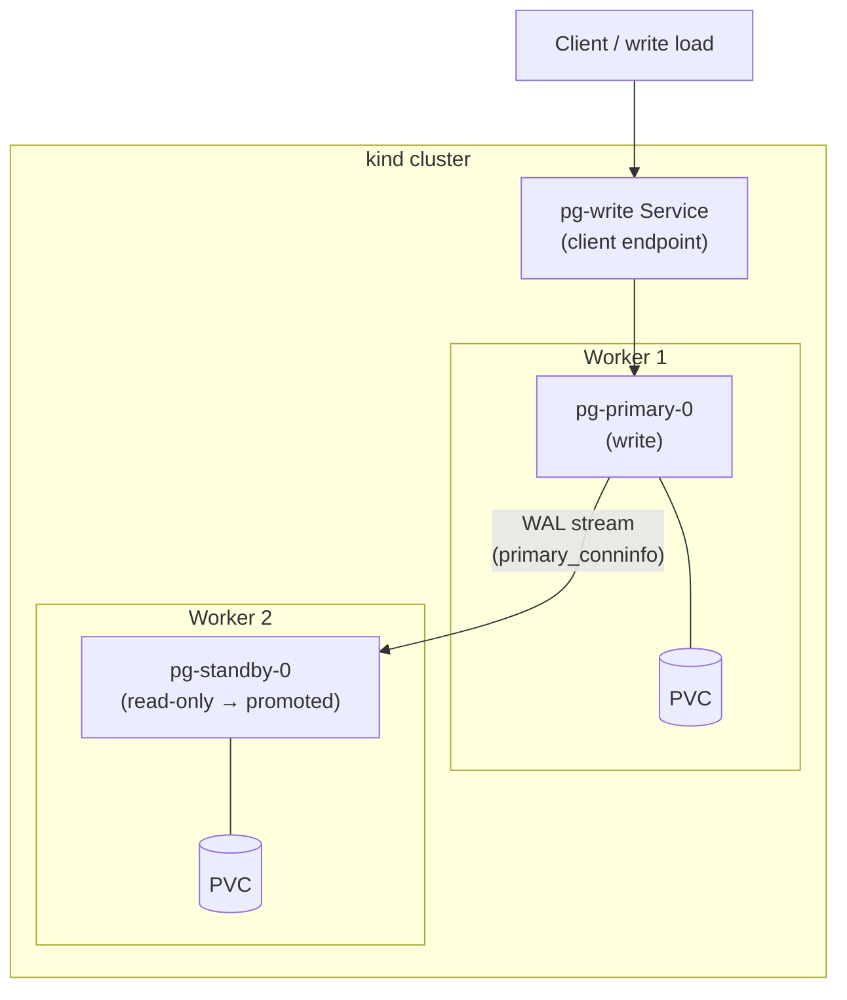

# PostgreSQL Streaming Replication on Kubernetes

A reproducible, two-node PostgreSQL cluster running on a local Kubernetes cluster — primary with a hot standby, streaming replication, measurable WAL lag, and scripted failover. Built with raw Kubernetes manifests and operational runbooks, no operators or Helm.

---

## Overview

This project demonstrates how to run stateful, asymmetric database roles on Kubernetes: a write-primary that ships WAL to a read-only standby, with a single bootstrap path from a clean host to a fully replicated cluster in under 15 minutes.

It covers the full lifecycle — provisioning, replication health checks, promotion under write load, client cutover, and post-failover data reconciliation — the same concerns that matter in production HA setups, at a scale you can run on a laptop.

---

## Architecture



| Component | Role |
|---|---|
| **Primary StatefulSet** | Accepts writes, generates WAL, exposes replication stats |
| **Standby StatefulSet** | Seeded via `pg_basebackup`, replays WAL, read-only until promoted |
| **Headless Services** | Stable per-pod DNS for replication and admin access |
| **`pg-write` Service** | Single client endpoint; repointed to the new primary after failover |
| **ConfigMaps** | `wal_level`, `pg_hba`, and replication settings — not baked into running pods |
| **Secrets** | Superuser and replication credentials, generated at bootstrap |

Primary and standby are pinned to different worker nodes via pod anti-affinity.

---

## What it demonstrates

- **PostgreSQL streaming replication** — WAL shipping, `primary_conninfo`, replication slots, LSN-based lag measurement
- **Stateful workloads on Kubernetes** — StatefulSets, headless services, PVC persistence, stable pod identity
- **Idempotent standby bootstrap** — `pg_basebackup` init container that skips re-copy when data already exists
- **Failover operations** — `pg_ctl promote`, recovery-mode checks, service selector cutover
- **Data consistency under async replication** — reconciling which rows survived promotion and why, tied to WAL replay position
- **Infrastructure as reproducible code** — one script, zero manual steps, full teardown and rebuild

---

## Tech stack

| Layer | Choice |
|---|---|
| Database | PostgreSQL 16 (official image) |
| Orchestration | Kubernetes via [kind](https://kind.sigs.k8s.io/) |
| Storage | `local-path` StorageClass (PVC per pod) |
| Tooling | `kubectl`, `psql`, `watch` |
| Config | Raw YAML manifests — no Helm, no operators |

---

## Quick start

**Prerequisites:** Docker, [kind](https://kind.sigs.k8s.io/docs/user/quick-start/#installation), [kubectl](https://kubernetes.io/docs/tasks/tools/)

```bash
# Bootstrap from a clean host: kind cluster + namespace + replication + seed data
./bootstrap.sh <your-id>

# Verify pods and replication
kubectl get pods,pvc -n pg-<your-id> -o wide
kubectl exec -n pg-<your-id> pg-primary-<your-id>-0 -- \
  psql -U postgres -c "SELECT state, sync_state, replay_lsn FROM pg_stat_replication;"
```

See [runbook.md](runbook.md) for lag checks, write-load generation, promotion, client repointing, and tear-down.

---

## Project structure

```
.
├── kind-config.yaml      # kind cluster: 1 control-plane + 2 workers
├── bootstrap.sh          # Parameterized one-shot provisioning
├── runbook.md            # Tested operational procedures
├── manifests/
│   ├── namespace.yaml
│   ├── configmap.yaml
│   ├── primary-statefulset.yaml
│   ├── standby-statefulset.yaml
│   ├── services.yaml
│   └── seed-job.yaml
└── evidence/             # Bootstrap timing, lag, and promotion transcripts
```

---

## Operations

### Replication lag

Compare primary and standby LSN positions side by side:

```sql
-- Primary
SELECT pg_current_wal_lsn();

-- Standby
SELECT pg_last_wal_replay_lsn();

-- Byte difference
SELECT pg_wal_lsn_diff(
  pg_current_wal_lsn(),
  pg_last_wal_replay_lsn()
);
```

### Failover

1. Promote standby: `pg_ctl promote` (or trigger-file alternative)
2. Confirm `pg_is_in_recovery()` returns `f`
3. Patch `pg-write` Service selector to the new primary
4. Reconcile row counts between old and new primary using LSN position at promotion time

Full step-by-step commands are in [runbook.md](runbook.md).

---

## Design decisions

**Two StatefulSets, not one.** Primary and standby have asymmetric roles. Separate StatefulSets let you promote the standby without reconfiguring the primary workload.

**Init container for `pg_basebackup`.** A standby cannot start from an empty data directory and catch up on its own. The init container seeds from the primary once; on pod restart it skips if `pgdata` already exists.

**Service-based client routing.** `pg-write` gives applications one stable endpoint. After promotion, a single selector patch moves writes to the new primary — no client reconfiguration.

**Async replication.** Rows committed on the old primary but not yet replayed on the standby at promotion time are lost on the new timeline. The runbook documents how to measure and explain that gap with real LSN numbers.

---

## License

MIT
