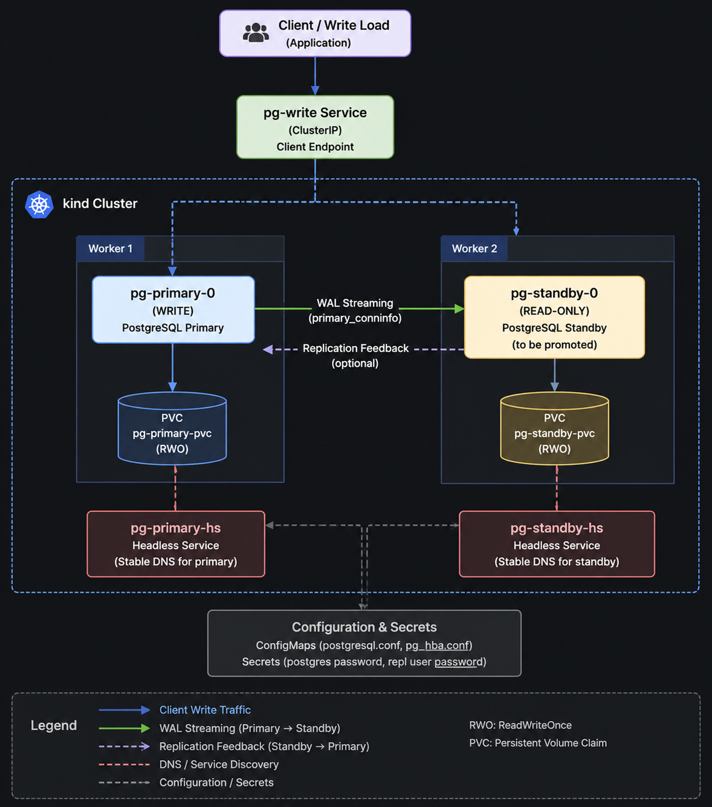

# PostgreSQL Streaming Replication on Kubernetes

A hands-on side project: run a two-node PostgreSQL cluster on [kind](https://kind.sigs.k8s.io/) with physical streaming replication - a writable primary, a hot standby seeded by `pg_basebackup`, measurable WAL lag, and scripted failover with client cutover.

Everything is raw Kubernetes YAML plus shell scripts. No Helm, no operators, no managed database services.

---

## Goal

Practice bringing up asymmetric Postgres roles on Kubernetes from a clean host, then operate them the way you would in a small lab: verify streaming, generate load, measure lag, promote the standby, repoint clients, and reconcile what async replication kept vs lost.

---

## What you practice

- StatefulSets, headless Services, and stable pod DNS for pod-to-pod replication
- ConfigMaps / Secrets for `postgresql.conf`, `pg_hba.conf`, and credentials
- Idempotent standby seeding with `pg_basebackup -R -X stream` in an initContainer
- Reading replication health (`pg_stat_replication`, LSNs, `pg_wal_lsn_diff`)
- Failover with `pg_ctl promote` / `pg_promote()`, then patching a write Service
- Tear-down and rebuild of a local kind environment

Day-2 commands live in [runbook.md](solution/runbook.md).

---

## Architecture



| Component               | Role                                                                            |
|-------------------------|---------------------------------------------------------------------------------|
| **kind cluster**        | 1 control-plane + 2 workers; primary and standby pinned to different workers    |
| **Primary StatefulSet** | Accepts writes, generates WAL, exposes replication stats                        |
| **Standby StatefulSet** | Seeded by an idempotent `pg_basebackup` initContainer; read-only until promoted |
| **Headless Services**   | Stable DNS for replication (`pg-primary-…-0.pg-primary-hs`, …)                  |
| **`pg-write` Service**  | ClusterIP clients use for writes; selector updated after failover               |
| **ConfigMap**           | `wal_level`, `max_wal_senders`, `pg_hba`, plus the basebackup script            |
| **Secret**              | Passwords created at bootstrap - never committed to git                         |

Storage: kind default `standard` (`local-path`) via `volumeClaimTemplates` - one PVC per pod.  
Image: official [`postgres:18`](https://hub.docker.com/_/postgres) with `PGDATA=/var/lib/postgresql/18/docker`.

```text
Clients --> pg-write (ClusterIP)
                |
                v
         Primary StatefulSet  --WAL stream-->  Standby StatefulSet
         (node-a)                               (node-b)
                ^
                |
         headless DNS: pg-primary-<ENV_ID>-0.pg-primary-hs
```

---

## Tech stack

| Layer    | Choice                                   |
|----------|------------------------------------------|
| Database | PostgreSQL 18                            |
| Cluster  | kind (local Kubernetes)                  |
| Storage  | `local-path` / `standard` StorageClass   |
| Tooling  | `kubectl`, `psql`, `envsubst`, `openssl` |
| Delivery | Raw YAML + `bootstrap.sh` / `destroy.sh` |

---

## Quick start

**Prerequisites:** Docker, [kind](https://kind.sigs.k8s.io/docs/user/quick-start/#installation), [kubectl](https://kubernetes.io/docs/tasks/tools/), `envsubst` (gettext)

Optional shell shortcuts (typing only - not part of the cluster):

```bash
export ENV_ID=hdhnguyen
export NS=pg-${ENV_ID}
export PRIMARY=pg-primary-${ENV_ID}-0
export STANDBY=pg-standby-${ENV_ID}-0
```

```bash
cd solution
cp scripts/.env.example scripts/.env   # optional; edit passwords or skip for random
./scripts/bootstrap.sh ${ENV_ID}

kubectl get pods,pvc -n ${NS} -o wide

kubectl exec -n ${NS} ${PRIMARY} -- \
  psql -h localhost -U postgres -c \
  "SELECT state, sync_state, replay_lsn FROM pg_stat_replication;"
```

Expect both pods `Running` on different nodes and one `streaming` row in `pg_stat_replication`.

Tear down:

```bash
./scripts/destroy.sh ${ENV_ID}
```

Full ops path (lag, load, promote, cutover, rebuild): [runbook.md](solution/runbook.md).

---

## Repository layout

```text
.
├── README.md
├── runbook.md              # copy-paste day-2 procedures
├── assets/                 # architecture diagram (optional)
└── solution/
    ├── kind-config.yaml    # 1 control-plane + 2 labeled workers
    ├── scripts/
    │   ├── bootstrap.sh    # kind + apply + seed + verify
    │   ├── destroy.sh
    │   └── .env.example    # copy to .env (gitignored)
    ├── manifests/
    │   ├── namespace.yaml
    │   ├── config/         # Secret template, postgres config, basebackup script
    │   ├── services/       # headless + pg-write
    │   └── statefulsets/   # primary + standby
    └── remote_infra/       # optional Terraform for a remote kind host
```

Namespace, object names, and seed table/rows are derived from the `ENV_ID` passed to bootstrap (for example `pg-hdhnguyen`, `events_hdhnguyen`).

---

## How it works

1. **Bootstrap** creates a kind cluster, fills manifests with `ENV_ID` and passwords (`envsubst`), applies them, waits for the primary, ensures the `repl` role, starts the standby (initContainer runs `pg_basebackup`), seeds database `clo835` / table `events_<ENV_ID>`, and checks streaming.
2. **Standby init** skips `pg_basebackup` if PGDATA already has cluster files, so pod restarts reuse the PVC instead of re-copying.
3. **Clients** write through `pg-write`. After promote, patch the Service selector to the former standby labels and scale down the old primary to avoid split-brain.
4. **Async replication** means commits past the standby replay LSN at promote time may be missing on the new timeline - the runbook shows how to measure that with LSNs and row counts.

---

## Design decisions

**Two StatefulSets, not one multi-replica set.** Primary and standby are different roles. Promotion should not require rewriting a shared peer set.

**InitContainer for `pg_basebackup`.** Streaming only ships WAL. The standby needs a consistent base copy first; `-R` writes `standby.signal` and `primary_conninfo`.

**One write Service.** Applications keep the same DNS name (`pg-write`); failover is a selector patch.

**Async by default.** Lag and row reconciliation make the trade-off visible instead of hiding it behind sync commits.

**Secrets out of git.** Passwords come from `scripts/.env` or are generated at bootstrap into a Kubernetes Secret.

---

## License

MIT
