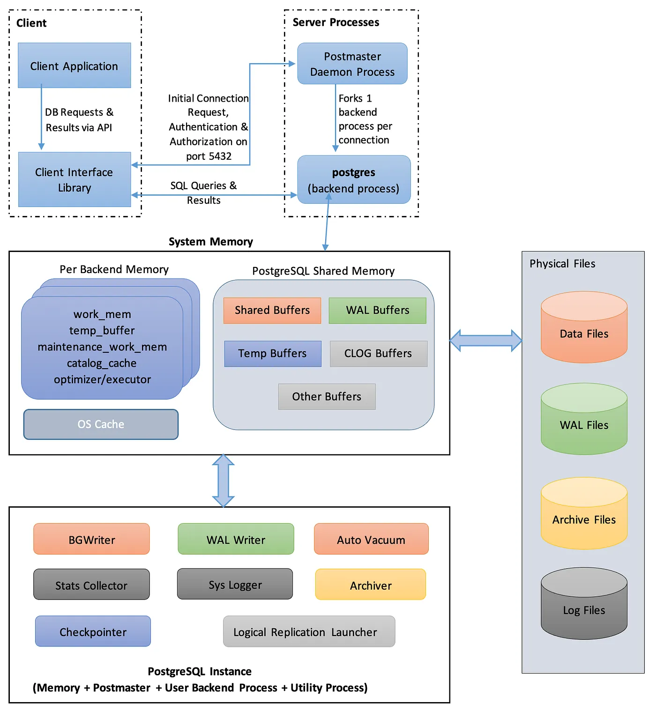

# 1. PostgreSQL  Architecture

It is important to understand how PostgreSQL is organized internally. Many replication features such as `pg_basebackup`,
WAL, and replication slots operate at the **cluster level**, not at the individual database level.




---

## 1.1 PostgreSQL Cluster
- A PostgreSQL **Cluster** is a single PostgreSQL server instance together with all of its data stored inside one data 
directory (`PGDATA`).
- Unlike Kubernetes or MongoDB, a PostgreSQL cluster **does NOT** mean multiple servers. It simply means 
**one PostgreSQL server managing multiple databases**.

Example:
```
PostgreSQL Cluster
│
├── postgres
├── db1
├── db2
├── replication
└── bookstoreDB
```
👉 All of these databases belong to the **same PostgreSQL Cluster**.

### A PostgreSQL Cluster contains:
- Multiple databases
- Roles (users)
- Tablespaces
- WAL files
- Configuration files
- System catalogs

👉 All replication operations work on the **entire cluster**, not on an individual database.

---

## 1.2 Database vs. Cluster
**‼️ One of the most common misconceptions is treating a PostgreSQL Cluster as a database.**

The relationship is:
```
PostgreSQL Cluster
│
├── Database A
├── Database B
├── Database C
└── Database D
```
👉 A **Database** is simply one logical database inside the cluster.

### When running:
```sql
CREATE DATABASE bookstore;
```

👉 PostgreSQL creates another database **inside the same cluster**.

### When using
```bash
psql -d bookstore
```

👉 Replication copies the **entire cluster**, meaning **every database, role, and system object is replicated**.

---

## 1.3 PostgreSQL Server Process
- The PostgreSQL server is **not a single process**. It is a **multi-process database server**
- When PostgreSQL starts, the operating system launches a parent process called `postgres`. This process is responsible 
for managing the entire PostgreSQL Cluster. It loads the configuration files, opens the data directory (`PGDATA`), 
listens for client connections on port 5432, and starts all required background processes.

```
                postgres (Parent Process)
                         │
      ┌──────────────────┼───────────────────┐
      │                  │                   │
      ▼                  ▼                   ▼
 Backend Process    WAL Writer        Checkpointer
(Client SQL)                             ...
```

👉 The parent process itself does not execute user SQL. Instead, it creates child processes, each with its own 
responsibility.


### Main Components

#### ✨ Parent Process (`postgres`)
- Starts the PostgreSQL server
- Reads configuration files
- Opens the PostgreSQL Cluster (`PGDATA`)
- Accepts incoming client connections
- Creates background processes
- Coordinates server shutdown

#### ✨ Backend Process
A backend process is created for each client connection.

Responsibilities:
- Executes SQL statements
- Reads and writes data
- Generates WAL records
- Returns query results to the client

Example:
```
Application
      │
      ▼
Backend Process
      │
      ▼
Execute SQL
```

#### ✨ WAL Writer
Responsible for writing WAL records to the `pg_wal` directory.

This guarantees that every committed transaction is first recorded in the Write-Ahead Log before the actual database 
files are updated.

#### ✨ Checkpointer
Periodically flushes modified pages from memory to the database files on disk.

This process creates checkpoints, which are essential for crash recovery and WAL recycling.

#### ✨ WAL Sender
Runs only on the **Primary**.

Responsible for reading WAL records from `pg_wal` and streaming them to connected standby servers.

There is typically **one WAL Sender process per connected standby**.

#### ✨ WAL Receiver
Runs only on the **Standby**.

Responsible for receiving WAL records from the Primary over the network.

#### ✨ Startup Process
Runs only on the **Standby**.

Responsible for replaying the received WAL records and applying the changes to the standby database.


### Process Flow During Streaming Replication
```
         PRIMARY

          Client
             │
             ▼
     Backend Process
             │
             ▼
        Generate WAL
             │
             ▼
         WAL Writer
             │
             ▼
          pg_wal
             │
             ▼
        WAL Sender
             │
        TCP Network
             │
             ▼
             
             

         STANDBY

        WAL Receiver
             │
             ▼
     Startup Process
             │
             ▼
      Apply WAL Replay
             │
             ▼
      Standby Database
```

👉 PostgreSQL is a **multi-process** database server.

👉 The parent `postgres` process manages the PostgreSQL Cluster.

👉 Every client connection gets its own **Backend Process**.

👉 The **WAL Writer** persists WAL records.

👉 The **Checkpointer** writes dirty pages to the data files.

👉 During streaming replication:
- **WAL Sender** exists on the Primary.
- **WAL Receiver** exists on the Standby.
- The **Startup Process** replays WAL to keep the standby synchronized.

---

## 1.4 `PGDATA` (Data Directory)
`PGDATA` is the root directory where PostgreSQL stores everything.

Example:
```
/var/lib/postgresql/18/docker
```

or
```
/var/lib/postgresql/data
```

depending on the installation.

Inside this directory are:
- All databases
- WAL
- Configuration
- Roles
- Replication slots
- Transaction status
- Metadata

Losing this directory means losing the entire PostgreSQL cluster.

---

## 1.5 Database File Layout
Inside `PGDATA`:
```
PGDATA/
│
├── base/
├── global/
├── pg_wal/
├── pg_replslot/
├── pg_stat/
├── pg_multixact/
├── pg_xact/
├── pg_tblspc/
├── postgresql.conf
├── postgresql.auto.conf
└── pg_hba.conf
```

### ✨ `base/`
Contains the actual data files for every user database.

Example:
```
base/
│
├── 1/
├── 16384/
├── 24576/
```

Each directory represents one database identified by its internal OID.

Tables inside each database are stored as individual files.

### ✨ `global/`
Stores cluster-wide objects that are shared by every database.

Examples include:
- Roles (users)
- System catalogs
- Shared metadata

Unlike `base/`, these objects belong to the entire cluster.

### ‼️ `pg_wal/`
Stores all `Write-Ahead Log (WAL)` files.

These files record every database modification before the actual data files are updated.

They are used for:
- Crash recovery
- Streaming replication
- PITR (Point-in-Time Recovery)

This directory is one of the most important components of PostgreSQL.

### ‼️ `pg_replslot/`
Stores metadata for replication slots.

Each slot records **how far a replication consumer (.e.g: standby, ...) has progressed**.

It **does not** store WAL itself.

Example:
```
pg_replslot/
│
├── standby1/
├── analytics/
└── backup/
```
Each directory contains only metadata used to determine which WAL files must be retained.

### ✨ `pg_stat/`
Stores runtime statistics collected by PostgreSQL.

These statistics are exposed through views such as:
```sql
SELECT * FROM pg_stat_replication;
```
They are used for monitoring and diagnostics.

### ✨ `pg_multixact/`
Stores information for `MultiXact` IDs.

Used primarily when multiple transactions simultaneously lock the same row.

### ✨ `pg_xact/`
Stores transaction commit status.

It allows PostgreSQL to determine whether a transaction is committed, rolled back, or is still in progress.

### ‼️ `postgresql.conf`
The main PostgreSQL configuration file.

Contains server configuration such as:
- Memory
- WAL settings
- Checkpoints
- Logging
- Networking

Typically edited by administrators.

### ‼️ `postgresql.auto.conf`

Automatically generated by PostgreSQL.

Updated whenever:

```sql
ALTER SYSTEM ...
```

is executed.

If the same parameter exists in both files, values in `postgresql.auto.conf` override those in `postgresql.conf`.

### ‼️ `pg_hba.conf`
**Host-Based Authentication** configuration.

Controls **who is allowed to connect**.

The configuration records the following syntax:
```shell
# TYPE    DATABASE        USER            ADDRESS                 METHOD
```

- `TYPE`: Specifies how the client is connecting.
  - `local`: Matches connection attempts using Unix-domain sockets.
  - `host`: Matches any TCP/IP-based connection (plain or encrypted).
  - `hostssl`: Requires the connection to use SSL/TLS encryption.
  - `hostnossl`: Restricts connections to unencrypted TCP/IP only.

- `DATABASE`: Specifies which database names match the rule.
  - `all`: Matches all databases.
  - `replication`: **Dedicated keyword to match replication streaming connections.**
  - `db1`,`db2`: Comma-separated list of database names.
  - `/regex`: Regular expression matches if prefixed with a forward slash.

- `USER`: Specifies which database user accounts match the rule.
  - `all`: Matches all users.
  - `username`: Matches a specific user account.
  - `@groupname`: Matches users belonging to a specific PostgreSQL role group.
  - `/regex`: Regular expression matches if prefixed with a forward slash.

- `ADDRESS`: Specifies the client machine's IP address range (omitted for local records).
  - `127.0.0.1/32`: Standard IPv4 loopback (localhost).
  - `::1/128`: Standard IPv6 loopback.
  - `192.168.1.0/24`: Subnet using CIDR block notation.
  - `all`, `samehost`, or `samenet`: Special network keywords.

- `METHOD`: Defines how the client must prove their identity.
  - `scram-sha-256`: Password-based authentication using secure cryptographic challenge-response (strongly recommended).
  - `md5`: Older, legacy password hashing option.
  - `trust`: Allows unconditional access without passwords (use only for trusted setups).
  - `reject`: Unconditionally drops matching connection attempts (useful for filtering specific subnets).
  - `peer`: Uses operating system user credentials (valid for local socket connections only).
  - `cert`, `gss`, `ldap`, `radius`: Enterprise-level protocol methods.

Example:

```shell
# TYPE    DATABASE        USER            ADDRESS                 METHOD
  host    replication     repl        172.20.0.0/16           scram-sha-256
  
  # Local Unix socket connections for the admin role
  local     all           postgres                                peer
  
  # IPv4 Local loopback connection for developers
  host      all             all        127.0.0.1/32            scram-sha-256  
```


👉 `PGDATA` contains the complete PostgreSQL cluster.

👉 `pg_wal` stores transaction logs, not table data.

👉 `pg_replslot` stores replication progress metadata, not WAL files.

👉 `postgresql.conf` defines the server configuration.

👉 `postgresql.auto.conf` stores configuration written by `ALTER SYSTEM`.

👉 `pg_hba.conf` determines which clients are allowed to connect and how they authenticate.


---

## References:
- [Medium - PostgreSQL Architecture](https://medium.com/@sumeet.k.shukla/postgresql-architecture-6df259dc1145)


## 6. Write-Ahead Logging (WAL)

- Why WAL exists
- WAL vs Data Files
- WAL Record
- WAL Segment
- WAL Directory (`pg_wal`)
- WAL Lifecycle
- WAL Recycling
- Checkpoint
- Crash Recovery

---

## 7. Streaming Replication

- Primary
- Standby
- Read-only Standby
- Streaming Replication
- Physical Replication
- Asynchronous Replication
- WAL Shipping
- WAL Streaming
- WAL Sender
- WAL Receiver

---

## 8. Log Sequence Number (LSN)

- What is LSN
- Why LSN exists
- `pg_current_wal_lsn()`
- `pg_last_wal_replay_lsn()`
- `pg_wal_lsn_diff()`
- Measuring Replication Lag

---

## 9. Replication Slots

- What is a Replication Slot
- Physical Replication Slot
- Logical Replication Slot (future)
- Slot Metadata
- `pg_replslot`
- Slot vs WAL
- Slowest Standby Rule
- Disk Full Risk

---

## 10. Base Backup

- `pg_basebackup`
- Full Cluster Copy
- Consistent Backup
- Why it runs only once
- Why it needs a replication role
- Why it uses the replication protocol

### Important Flags

- `-D`
- `-R`
- `-X stream`
- `-P`

---

## 11. Standby Initialization

- `standby.signal`
- `primary_conninfo`
- Standby Startup Sequence
- Recovery Mode
- `pg_is_in_recovery()`

---

## 12. Replication Connection Flow

```text
Standby
      │
      │ TCP
      ▼
Docker Network
      │
      ▼
Primary
      │
      ▼
pg_hba.conf
      │
      ▼
Role Authentication
      │
      ▼
Replication Protocol
      │
      ▼
WAL Streaming
```

---

## 13. Replication Failure Scenarios

- Network Partition
- Standby Offline
- WAL Removed
- Missing Replication Slot
- `wal_keep_size` Too Small
- Rebuild using `pg_basebackup`

---

## 14. Security

- Why `listen_addresses='*'`
- Production Networking
- Restricting `pg_hba.conf`
- Least Privilege
- Replication User
- Password Storage
- SCRAM
- Secrets

---

## 15. Useful Commands

### Configuration

```sql
SHOW ...
```

```sql
ALTER SYSTEM ...
```

### Roles

```sql
CREATE ROLE
```

```sql
\du
```

### WAL

```sql
SELECT pg_current_wal_lsn();
```

### Replication

```sql
SELECT * FROM pg_stat_replication;
```

### Recovery

```sql
SELECT pg_is_in_recovery();
```

### Settings

```sql
SELECT * FROM pg_settings;
```

---

## 16. Concepts Still To Learn

- Checkpoints
- WAL Internals
- WAL Record Format
- Timeline
- Promotion
- Failover
- Split Brain
- Synchronous Replication
- Logical Replication
- Replication Slots in Production
- Archiving
- Point-in-Time Recovery (PITR)
- Hot Standby Feedback
- Vacuum and Replication
- Replication Lag Monitoring
- Cascading Replication
- Replication Timeout
- PostgreSQL on Kubernetes
- StatefulSets for PostgreSQL
- PVCs and Persistent Storage
- Services for Primary/Standby
- Failover Service Switching
- High Availability Patterns
- Patroni (for comparison)
- CloudNativePG (for comparison)